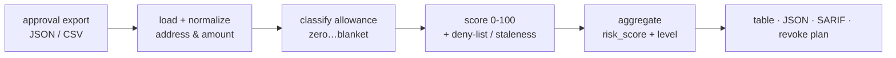

<a name="top"></a>
<div align="center">


# APPROVEWARDEN

### Scan any wallet's token approvals for infinite allowances and `setApprovalForAll` blanket grants, score drainer exposure 0-100, and get an advisory revoke plan — fully offline.

[](https://pypi.org/project/cognis-approvewarden/) [](https://github.com/cognis-digital/approvewarden/actions) [](https://github.com/cognis-digital/approvewarden/actions/workflows/ports.yml) [](LICENSE) [](https://github.com/cognis-digital)

*Web3 & smart-contract security — wallet approval hygiene as a single, scriptable command.*

</div>

```bash
pip install cognis-approvewarden
approvewarden scan approvals.json          # → prioritized findings + a 0-100 risk score
```

`approvewarden` reads an **exported approval set** (the list of `approve` /
`setApprovalForAll` grants on a wallet, dumped from an explorer or indexer as
JSON/CSV) and tells you which of them a drainer could exploit. It does **no
network calls and signs nothing** — it is a deterministic, CI-friendly auditor
you can run in a pipeline, a pre-flight check, or an AI agent.

## Contents

- [Why](#why) · [What it detects](#detects) · [Install](#install) · [Quickstart](#quickstart) · [Worked example](#example) · [Input format](#input) · [Output formats](#output) · [Revoke plan](#revoke) · [CI gating](#ci) · [Edge / air-gap](#edge) · [Language ports](#ports) · [Scope & safety](#safety) · [Architecture](#architecture) · [Integrations](#integrations) · [Related tools](#related) · [License](#license)

<a name="why"></a>
## Why approvewarden?

Most wallet drains don't break cryptography — they abuse an approval the victim
already signed. An infinite `approve(spender, 2^256-1)` or a
`setApprovalForAll(operator, true)` is a standing licence to move your tokens,
and it lives forever until you revoke it. Treasuries, DAOs, and bots accumulate
dozens of these and never look back.

`approvewarden` is a headless, scriptable revoke.cash you can run in CI: point
it at an approval export, get the risky grants ranked worst-first, gate a build
on the result, and hand an agent a copy-pasteable revoke plan. It is offline by
design, so it is safe to run against treasury data in an air-gapped review.

<div align="right"><a href="#top">↑ back to top</a></div>

<a name="detects"></a>
## What it detects

| Class | What it means | Base weight |
|---|---|---|
| `blanket` | `setApprovalForAll` — spender controls **every** ERC-721/1155 token in the collection | 60 |
| `infinite` | `uint256`/`uint96` max sentinel allowance | 55 |
| `effectively_infinite` | allowance ≥ 10¹⁵ tokens (no legitimate grant needs this) | 45 |
| `finite` | bounded allowance | 10 |
| `zero` | revoked / never granted — **not** reported | 0 |

These escalate when the spender is risky:

- **+100** spender address on a drainer **deny-list** you supply (`--drainer-list`), or labelled with a known drainer family (`pink-drainer`, `inferno`, `angel-drainer`, `phishing`, …) → **critical**.
- **+25** spender contract is **unverified**.
- **+15 / +8** the grant is **stale** (>1y) or **aging** (>180d) and never revoked — a wider attack window.

Scores clamp to 0-100 and bucket into `low / medium / high / critical`. The
wallet's aggregate `risk_score` is a worst-offender-weighted blend, never lower
than the single worst grant — one critical approval dominates the report.

<div align="right"><a href="#top">↑ back to top</a></div>

<a name="install"></a>
## Install

```bash
pip install cognis-approvewarden                                          # PyPI (when published)
pip install -e .                                                          # from a clone (works today)
pip install "git+https://github.com/cognis-digital/approvewarden.git"     # straight from GitHub
pipx install "git+https://github.com/cognis-digital/approvewarden.git"    # isolated CLI
uv tool install "git+https://github.com/cognis-digital/approvewarden.git" # uv
```

Python 3.10+. The core has **zero runtime dependencies** (standard library
only). Optional extras: `[mcp]` for the MCP server, `[connect]` for
cognis-connect forwarding, `[dev]` for the test suite.

<div align="right"><a href="#top">↑ back to top</a></div>

<a name="quickstart"></a>
## Quickstart

```bash
# 1. Human-readable table (default)
approvewarden scan demos/01-basic/approvals.json

# 2. Machine-readable JSON for jq / agents / CI
approvewarden scan approvals.csv --format json | jq .risk_score

# 3. SARIF for GitHub code-scanning dashboards
approvewarden scan approvals.json --format sarif > approvewarden.sarif

# 4. Advisory revoke plan (read-only; nothing is signed)
approvewarden scan approvals.json --emit-revoke

# 5. Pipe an export straight from stdin
cat approvals.json | approvewarden scan -

# 6. Add your own drainer address deny-list (offline file)
approvewarden scan approvals.json --drainer-list drainers.txt
```

Exit codes: `0` clean / below `--fail-on`, `2` risky findings at/above
`--fail-on` (default `high`), `1` usage or parse error.

<div align="right"><a href="#top">↑ back to top</a></div>

<a name="example"></a>
## Worked example

The bundled [`demos/01-basic/approvals.json`](demos/01-basic/approvals.json) is
a six-approval wallet: a real Uniswap router infinite-USDC grant, an unverified
effectively-infinite DAI spender, a `setApprovalForAll` to a label flagged
`Pink-Drainer`, a multi-year-stale infinite LINK grant, a bounded WETH
allowance, and one already-revoked (zero) SHIB approval.

```text
$ approvewarden scan demos/01-basic/approvals.json
APPROVEWARDEN 0.2.0 — approval audit
============================================================
Risk: 100/100 (CRITICAL)   active=5  infinite/blanket=4
Severity: critical=2  high=2  medium=0  low=1
------------------------------------------------------------
SEV  SCORE  TOKEN      SPENDER        KIND
!!     100  BAYC       Pink-Drainer   blanket
        - setApprovalForAll grants the spender control of ALL ERC721 tokens
        - spender labelled as known-malicious (Pink-Drainer)
        - stale approval (never revoked)
!!      85  DAI        0xdead…beef    effectively_infinite
        - allowance is astronomically large (effectively infinite)
        - spender contract is unverified
!       70  USDC       Uniswap V3 Router infinite
        - unlimited allowance (uint256/uint96 max sentinel)
!       70  LINK       Legacy Router  infinite
        - unlimited allowance (uint256/uint96 max sentinel)
.       25  WETH       1inch Aggregator finite
        - finite, bounded allowance
------------------------------------------------------------
Revoke infinite/blanket and malicious-spender approvals via
revoke.cash or eth_call to approve(spender, 0).
```

The already-revoked SHIB approval is correctly dropped (zero allowance is not a
finding), and the `Pink-Drainer` blanket grant is ranked first.

<div align="right"><a href="#top">↑ back to top</a></div>

<a name="input"></a>
## Input format

Supply a JSON array, a JSON object with an `approvals` key, or a CSV with a
header row. Field aliases are accepted (`token`/`contract`,
`token_symbol`/`symbol`, `spender_label`/`label`, `amount`/`allowance`,
`is_approval_for_all`/`approval_for_all`). `amount` accepts decimal, hex
(`0x…`), and the literals `max` / `unlimited` / `infinite`.

```json
{
  "owner": "0x1111…1111",
  "approvals": [
    {
      "token": "0xA0b8…eB48", "token_symbol": "USDC",
      "spender": "0xE592…1564", "spender_label": "Uniswap V3 Router",
      "spender_verified": true, "standard": "ERC20",
      "amount": "max", "last_updated": 1735689600
    },
    {
      "token": "0xBC4C…f13D", "token_symbol": "BAYC",
      "spender": "0xBAD…bad", "spender_label": "Pink-Drainer",
      "spender_verified": false, "standard": "ERC721",
      "is_approval_for_all": true
    }
  ]
}
```

CSV equivalent:

```csv
token,symbol,spender,amount,standard,spender_verified,last_updated
0xA0b8…eB48,USDC,0xE592…1564,max,ERC20,true,1735689600
```

Approval exports come from explorer/indexer APIs (Etherscan, Covalent,
Alchemy, a subgraph) or your own RPC dump — `approvewarden` deliberately does
**not** fetch them itself, which is what keeps it offline and deterministic.

<div align="right"><a href="#top">↑ back to top</a></div>

<a name="output"></a>
## Output formats

| `--format` | Use |
|---|---|
| `table` (default) | terminal review, color-free, glyph-prefixed severities |
| `json` | the full report dict — `risk_score`, `risk_level`, `severity_counts`, sorted `findings[]`, `clean` |
| `sarif` | SARIF 2.1.0 for GitHub code-scanning and any SARIF viewer |

The JSON report shape (also emitted identically by every [language port](#ports)):

```json
{
  "tool": "approvewarden",
  "total_approvals": 6,
  "active_approvals": 5,
  "infinite_approvals": 4,
  "risk_score": 100,
  "risk_level": "critical",
  "severity_counts": {"info": 0, "low": 1, "medium": 0, "high": 2, "critical": 2},
  "findings": [ { "token": "0x…", "token_symbol": "BAYC", "spender": "0x…",
                  "allowance_kind": "blanket", "severity": "critical",
                  "score": 100, "reasons": ["…"], "amount": "…" } ],
  "clean": false
}
```

<div align="right"><a href="#top">↑ back to top</a></div>

<a name="revoke"></a>
## Advisory revoke plan

`--emit-revoke` turns the findings into the exact calls you would make to
revoke — `approve(spender, 0)` for ERC-20 or `setApprovalForAll(spender, false)`
for ERC-721/1155. **It is advisory only**: approvewarden never builds, signs, or
broadcasts a transaction. Review each call and sign it in your own wallet
(or paste into revoke.cash).

```text
$ approvewarden scan demos/01-basic/approvals.json --emit-revoke
APPROVEWARDEN 0.2.0 — advisory revoke plan
============================================================
4 approval(s) recommended for revocation (advisory only — sign in your own wallet):
------------------------------------------------------------
 1. [CRITICAL] BAYC       ERC721
      token:  0xbc4ca0eda7647a8ab7c2061c2e118a18a936f13d
      call:   setApprovalForAll(0xbadbabe000000000000000000000000000000bad, false)
 2. [CRITICAL] DAI        ERC20
      token:  0x6b175474e89094c44da98b954eedeac495271d0f
      call:   approve(0xdead00000000000000000000000000000000beef, 0)
...
```

Use `--revoke-min critical` to limit the plan to the worst grants, or
`--format json` to pipe the plan into a wallet UI.

<div align="right"><a href="#top">↑ back to top</a></div>

<a name="ci"></a>
## CI gating

```yaml
# .github/workflows/approval-audit.yml
- run: pip install cognis-approvewarden
- run: approvewarden scan treasury-approvals.json --fail-on high
# upload SARIF to the Security tab
- run: approvewarden scan treasury-approvals.json --format sarif > aw.sarif
- uses: github/codeql-action/upload-sarif@v3
  with: { sarif_file: aw.sarif }
```

`--fail-on {low,medium,high,critical}` controls the exit-2 threshold so the job
fails the moment a new risky approval lands in the export.

<div align="right"><a href="#top">↑ back to top</a></div>

<a name="edge"></a>
## Edge / air-gap

Because approvewarden has **no network calls and zero runtime dependencies**, it
runs unchanged on an air-gapped reviewer machine:

1. On a connected host, export the wallet's approvals to `approvals.json` and
   (optionally) build a `drainers.txt` address deny-list from your threat feed.
2. Carry both files across the gap.
3. `approvewarden scan approvals.json --drainer-list drainers.txt --format sarif`.

The deny-list is a plain newline-delimited file of `0x…` spender addresses
(`#` comments allowed); approvewarden ships **no** hard-coded addresses, so it
never makes an unverified on-chain accusation — you control the intel.

<div align="right"><a href="#top">↑ back to top</a></div>

<a name="ports"></a>
## Language ports

The same audit core is implemented in four languages, each producing the
identical JSON report and verified in CI ([`ports.yml`](.github/workflows/ports.yml)):

| Language | Path | Run | Test |
|---|---|---|---|
| Python (reference) | [`approvewarden/`](approvewarden) | `approvewarden scan approvals.json` | `pytest` |
| JavaScript / Node | [`ports/javascript/`](ports/javascript) | `node ports/javascript/index.js approvals.json` | `node ports/javascript/test.js` |
| Go | [`ports/go/`](ports/go) | `cd ports/go && go run . ../../demos/01-basic/approvals.json` | `go test ./...` |
| Rust | [`ports/rust/`](ports/rust) | `cd ports/rust && cargo run -- ../../demos/01-basic/approvals.json` | `cargo test` |

All four agree on the demo fixture: `risk_score=100`, `risk_level=critical`,
`active=5`, `infinite/blanket=4`, worst grant `BAYC`.

<div align="right"><a href="#top">↑ back to top</a></div>

<a name="safety"></a>
## Scope & safety

- **Defensive, authorized-use only.** approvewarden audits approval data *you
  already have* for *wallets you are responsible for*. It is not a targeting or
  intrusion tool.
- **Offline and passive.** No RPC, no explorer calls, no chain scanning. You
  feed it an export; it scores it.
- **Signs nothing.** The revoke plan is advisory text — approvewarden never
  builds, signs, or broadcasts a transaction.
- **No fabricated intel.** The deny-list is whatever addresses *you* provide;
  the only built-in signal is generic drainer-family *labels* that explorers
  already attach.

<div align="right"><a href="#top">↑ back to top</a></div>

<a name="architecture"></a>
## Architecture



Pure functions, deterministic given a fixed `now`. See
[`docs/ARCHITECTURE.md`](docs/ARCHITECTURE.md).

<div align="right"><a href="#top">↑ back to top</a></div>

<a name="integrations"></a>
## Integrations & AI stacks

- **MCP server** — `approvewarden mcp` exposes `scan()` as a tool for Claude Desktop, Cursor, and Cognis.Studio (needs the `[mcp]` extra).
- **cognis-connect** — `approvewarden scan … --format json | approvewarden-emit --to stix` forwards findings as STIX/MISP/Sigma/Splunk/Elastic/Slack/webhook (needs the `[connect]` extra).
- **SARIF** — `--format sarif` drops straight into GitHub code-scanning.
- **JSON** — pipe into any agent, LLM, LangChain/CrewAI/AutoGen tool, or SIEM.

See [`docs/INTEGRATIONS.md`](docs/INTEGRATIONS.md) and [INTEROP.md](INTEROP.md).

<div align="right"><a href="#top">↑ back to top</a></div>

<a name="related"></a>
## Related Cognis tools

- [`sigsleuth`](https://github.com/cognis-digital/sigsleuth) — decodes raw calldata and EIP-712 typed-data, flagging blind-signing and malicious permit/Permit2 payloads.
- [`rugradar`](https://github.com/cognis-digital/rugradar) — token-contract risk scanner: honeypots, hidden mint/blacklist, owner backdoors, unlocked liquidity.
- [`reentryx`](https://github.com/cognis-digital/reentryx) — static + symbolic reentrancy detector with CI-gating SARIF output.
- [`mevscope`](https://github.com/cognis-digital/mevscope) — attributes sandwich/frontrun/backrun MEV extraction with per-trade loss accounting.
- [`forkfuzz`](https://github.com/cognis-digital/forkfuzz) — mainnet-fork invariant fuzzer.
- [`storagelens`](https://github.com/cognis-digital/storagelens) — diffs/decodes contract storage layouts across proxy upgrades.

**Explore the suite →** [🗂️ all tools](https://github.com/cognis-digital/cognis-neural-suite) · [🤖 uncensored-fleet](https://github.com/cognis-digital/uncensored-fleet) · [🧠 engram](https://github.com/cognis-digital/engram)

<div align="right"><a href="#top">↑ back to top</a></div>

## Contributing

PRs, new ports, deny-list improvements, and demo scenarios are welcome under the
collaboration-pull model — see [CONTRIBUTING.md](CONTRIBUTING.md) and
[SECURITY.md](SECURITY.md).

> ### ⭐ If `approvewarden` saved your tokens, **star it** — it helps others find it.

<a name="license"></a>
## License

Source-available under the **Cognis Open Collaboration License (COCL) v1.0** —
free for personal, internal-evaluation, research, and educational use;
**commercial / production use requires a license** (licensing@cognis.digital).
See [LICENSE](LICENSE).

---

<div align="center"><sub><b><a href="https://cognis.digital">Cognis Digital</a></b> · part of the <a href="https://github.com/cognis-digital/cognis-neural-suite">Cognis Neural Suite</a> · <i>Making Tomorrow Better Today</i></sub></div>
